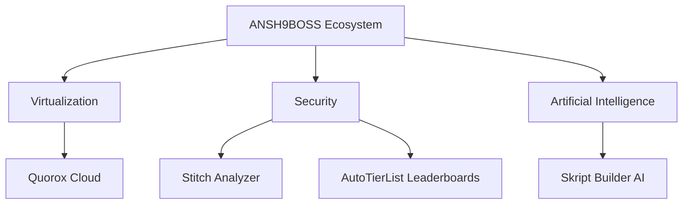

# Developer Profile: ANSH9BOSS
---

Upgraded developer profile containing contact credentials, technical stack, core systems architecture, projects, and deployment statistics for **ANSH9BOSS**.

## 👤 Personal & Contact Info

| Field | Value |
|---|---|
| **Primary Handle** | `ANSH9BOSS` |
| **Title** | Overall Developer |
| **Email Address** | [anshkumar19zx@gmail.com](mailto:anshkumar19zx@gmail.com) |
| **Discord Username** | [ansh9boss](https://discord.com/users/ansh9boss) |
| **GitHub Profile** | [github.com/ANSH9BOSS](https://github.com/ANSH9BOSS) |
| **Live URL** | [ansh9boss2.vercel.app](https://ansh9boss2.vercel.app) |

---

## 🛠️ Technical Stack & Expertise

ANSH9BOSS is a full-stack overall developer specializing in low-level game security engineering, container virtualization infrastructure, and custom AI tools.

### 1. Cloud Virtualization & Game Hosting
*   **Virtualization Stack**: WHMCS Billing APIs, Pterodactyl Panel Orchestration, Wings Daemon, Docker Containerization.
*   **Engineering**: Founded and engineered **Quorox Cloud**, provisioning and maintaining automated, high-availability VPS slots, node memory boundaries, and server allocations.

### 2. Artificial Intelligence & Automation
*   **Custom AI Systems**: Developed **Skript Builder AI**, an autonomous artificial intelligence platform fine-tuned to compile optimized Minecraft Skript templates, audit syntax trees, and automate Minecraft server scripts.

### 3. Application & Systems Engineering
*   **Desktop & Cross-Platform**: React Native, Electron container shells, Native Node.js bindings, and local process scanning systems.
*   **Web Dashboards**: React.js, Next.js, Tailwind CSS, GSAP, and Node.js for data-intensive admin panels and real-time socket connections.

### 4. Game Security & Minecraft Optimization
*   **Low-Level Hooking**: Spigot/Paper NMS (Net.Minecraft.Server) packets interception, Netty pipelines, and Java packet validators.
*   **Anti-Cheat Development**: Created **Stitch Analyzer**, combining Electron process memory scanners and JVM-level combat check daemons to block injects and hardware macros.

---

## 🚀 Key Projects

### 1. Quorox Cloud
*   **Role**: Founder & Core Engineer (2026 - Present)
*   **Details**: High-availability VPS container virtualization platform integrating Pterodactyl daemon nodes with WHMCS automated checkout billing APIs. Scales setups down to under 10 seconds.
*   **Stack**: Next.js, TypeScript, Node.js, Docker, WHMCS API, Pterodactyl.

### 2. Stitch Analyzer
*   **Role**: Lead Systems & Anti-Cheat Developer (2025 - Present)
*   **Details**: Double-sided anticheat engine. Combines an Electron process memory scanning launcher that audits loaded DLL registers with a Spigot/Paper Java NMS validator checking packet timing anomalies.
*   **Stack**: TypeScript, Java NMS, Electron, Node.js, Netty.

### 3. Skript Builder AI
*   **Role**: AI Architect & Systems Developer (2026 - Present)
*   **Details**: Conversational AI trained on Minecraft script templates and Paper-native Skript plugins to generate optimized `.sk` files, check script syntax, and auto-deploy scripts to servers.
*   **Stack**: Next.js, React, Vercel AI SDK, Python, Node.js.

### 4. AutoTierList Leaderboards
*   **Role**: Full-Stack Engineer (2025 - Present)
*   **Details**: Automatic player rating tracking leaderboard parsing server event logs in real-time, syncing metrics with automated Discord role matrices.
*   **Stack**: React, Node.js, Socket.io, MongoDB.

### 5. Elite Portfolios
*   **Role**: UI/UX Developer
*   **Details**: High-end interactive client portfolios utilizing custom WebGL, canvas physics, GSAP animations, and 3D Spline renders.
*   **Stack**: React, Next.js, Spline, Three.js, GSAP.

### 6. 100+ Discord Bots
*   **Role**: Automation Engineer
*   **Details**: Large suite of custom bots handling automated server ticketing, user verification checks, and automated e-commerce status logs.
*   **Stack**: Node.js, Discord.js, MongoDB.

---

## 📊 Key Statistics

*   **Total Users Reached**: 500,000+
*   **Custom Discord Bots Deployed**: 100+
*   **Virtualized Container Nodes Managed**: 142+ active slots
*   **AI Assistants Deployed**: 1 (Skript Builder AI platform)
*   **Client Servers Secured**: Extensive Minecraft networks secured with Stitch Analyzer.
